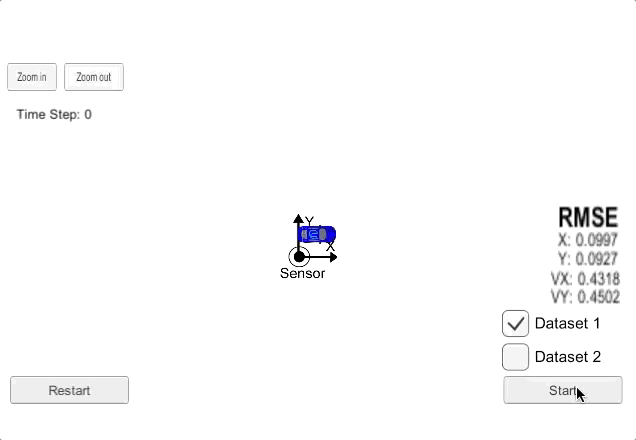
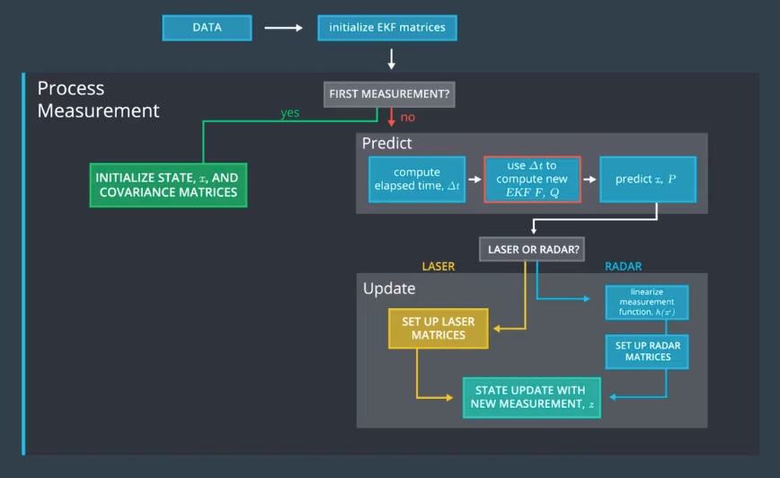
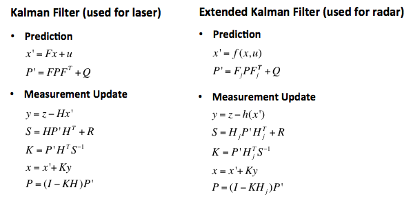
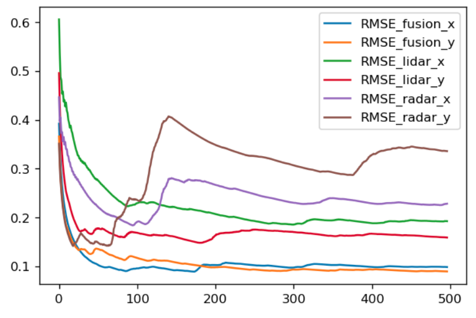

## Extended Karman Filter

#### Zhenglei 2018 January

This is a project to estimate the car position from Lidar data and Radar data. Lidar data is using Kalman filter. Radar data is using Extended Karman filter, because the radar data is provided by non-linear data(rho, rho-dot, phi). Then we put the two types of sensor data together, and get an more accurate estimate. The solution is so called sensor fusion.


The following gif picture is record from the simulator.
- Blue circle: radar measurement
- Red circle: laser measurement
- Green circle : EKF estimated position



### 1.Create the enviroment for carnd-term2

I don't have an mac, and my working PC is install windows7

So, this is the options

1) windows7 professinal + vmware(ubuntu), not work
2) windows7 professinal + docker, not work
3) pure ubuntu, it works
... I haven't test

So, this is the suggestion, if you are using windows7. Don't try anything on it. It will waste your time.
**Buy a computer or borrow a computer, then install ubuntu** (16.4 is the version use)

### 2. From a empty computer to run the code with Simulator

#### 2.1 install ubuntu   
&nbsp;&nbsp; (PreRequirment: you already have another windows PC)  
&nbsp;&nbsp; on the windows pc:
&nbsp;&nbsp; 1)down ubuntu from https://www.ubuntu.com/download/desktop  
&nbsp;&nbsp; 2)this installation guide: https://tutorials.ubuntu.com/tutorial/tutorial-create-a-usb-stick-on-windows#0  
&nbsp;&nbsp; 3)create a bootable USB flash disk include ubuntu image, using `Rufus` :https://rufus.akeo.ie/  

&nbsp;&nbsp; on the empty linux comupter:
&nbsp;&nbsp; 1) boot the computer using the USB flash disk
&nbsp;&nbsp; 2) install linux


#### 2.2 download project from github
https://github.com/udacity/CarND-Extended-Kalman-Filter-Project

#### 2.3 install uWebSocket
uWebSocket is software to connect our C++ program and the simulator.
In the project folder, execute `sudo sh ./install-ubuntu.sh`  
This command will installed uWebSockets.


#### 2.4 download simulator
term2_sim.x86_64, download it from https://github.com/udacity/self-driving-car-sim/releases/
  hins:
  1) add execute permission to the file `sudo chmod -c 777 <your file name>`
  2) **The simulator may corrupt sometimes**, so unzip it from the download file, or download it again

#### 2.5 install anaconda and jupyter notebook
The python jupyter notebook is used for analyze the output log file.

check conda version
`conda --version`

If you computer don't have anaconda, then you could download **anaconda** or **miniconda**. Any of them is OK.

miniconda is about 50M. Download from:
https://conda.io/miniconda.html

anaconda is about 500M. Download from:
https://www.anaconda.com/download/#linux

Then install it,

- miniconda
`bash Miniconda3-latest-Linux-x86_64.sh `  
- anaconda
`bash Anaconda-latest-Linux-x86_64.sh`

I use the enviroment from udacity Carnd-term1
https://github.com/udacity/CarND-Term1-Starter-Kit/blob/master/doc/configure_via_anaconda.md

Set the enviroment like this:
``` bash
git clone https://github.com/udacity/CarND-Term1-Starter-Kit.git
cd CarND-Term1-Starter-Kit
```
Then run these commands, will create an conda enviroment, include the libraries we need.
`conda env create -f environment.yml`

Activate the enviroment
`source activate carnd-term1`

Then get into the jupyter notebook
`jupyter notebook`


## 3. Install some usefull software (optional)

#### 3.1 Install chrome in ubuntu 
&nbsp;&nbsp;   (If you like, the firefox is good enough also)
  https://www.cyberciti.biz/faq/how-to-install-google-chrome-in-ubuntu-linux-12-xx-13-xx/  

#### 3.2 Install uGet download tools
If you want download something big in linux, you may need a download tool.
The uGet website: http://ugetdm.com/downloads-ubuntu

Install uget using command line

```bash
sudo add-apt-repository ppa:plushuang-tw/uget-stable
sudo apt update
sudo apt install uget
```
Then, install aria2 plugin for uGet
```bash
sudo apt install aria2
```
After these, search uGet in ubuntu search bar, you will found uGet.

#### 3.3 Haroopad markdown editor 
download from this site:  http://pad.haroopress.com/user.html
Your downloaded Haroopad package could be an deb package. How to install an deb package?
`sudo dpkg -i xxxx.deb`

## 4.Data Flow



1) The measuremennt processor/matlab simulator is generating the FUSION .txt file:
	"data/obj_pose-laser-radar-synthetic-ukf-input.txt";
	OR
	"../matlab_examples/obj_pose-laser-radar-synthetic-ukf-input.txt";

The Input file format is:
L(for laser) meas_px meas_py timestamp gt_px gt_py gt_vx gt_vy (gt is ground truth)
R(for radar) meas_rho meas_phi meas_rho_dot timestamp gt_px gt_py gt_vx gt_vy (gt is ground truth)

Example:
R	8.60363	0.0290616	-2.99903	1477010443399637	8.6	0.25	-3.00029	0
L	8.45	0.25	1477010443349642	8.45	0.25	-3.00027	0


2) The EKF Algorithm reads form file reads all the lines and generates measurement structures

3) The MeasurementProcessor() is called with individual measurements (one by one). The results are saved
(Attention: no file processing routines are used inside MeasurementProcessor() all the file processing routines are in the main function.
So the data read/write is decoupled from the algorithm

4) The results are saved in an output file:
"data/obj_pose-laser-radar-ekf-output.txt"

Output file format:
est_px est_py est_vx est_vy meas_px meas_py gt_px gt_py gt_vx gt_vy

Example:
4.53271	0.279	-0.842172	53.1339	4.29136	0.215312	2.28434	0.226323
43.2222	2.65959	0.931181	23.2469	4.29136	0.215312	2.28434	0.226323

## 5.CMakeLists.txt
There is nothing need to change in the CMakeLists.txtx

## 6.Program structure
#### overview of the formular


#### Tools.h         
define a class named "tools" , and 2 method:
- CalculateRMSE
- CalculateJacobian

#### Tools.app       
Implementation of the 2 method.


#### measurement_package.h	
Defines a class called "MeasurementPackage". 
It include the data of a measurement. 

#### Kalman_filter.h  
Defines a class named "KalmanFilter"
The class include some data
- x_ state vector
- P_ covariance matrix
- F_ state transition matrix
- Q_ process covariance matrix
- H_ measurement matrix
- R_ measurement covariance

The class defined some method
- Init: initializes Kalman filter
- Predict :predicts the state and state covariance, using the process model
- update :update the state by using standard Kalman Filter equations.
- updateEKF :update the state by using Extended Kalman Filter equations.

#### Kalman_filter.cpp  
Implementation the method defined by Kalman_filter.h

#### FusionEKF.h	
Head file of FusionEKF.cpp
Define a class called FusionEKF
Define a method ProcessMeasurement, a public KalmanFilter

#### FusionEKF.cpp   
Implementation the method difined by FusionEKF.h

#### Main.cpp
- Check_arguments:  I add an option to the program, select `fusion`or`onlyRadar`or`onlyLidar`
- hasData:
- main:
&nbsp;&nbsp; - write logfile, depend on the option you select.The logfile could be **log_fusion.txt** or **log_onlyRadar.txt** or **log_onlyRidar.txt**.
&nbsp;&nbsp; - using uWS to communicate with Simulator.
&nbsp;&nbsp; - calculate RMSE(root mean squre error) between estimations and ground truth. 
&nbsp;&nbsp; - Json is the message type, send to, or receive from the simulator.
&nbsp;&nbsp; - extrac variables form istringstream, and put them into 
&nbsp;&nbsp; - Call ProcessMeasurment(meas_package) for Kalman filter
&nbsp;&nbsp; - 


## 7 Compile and run
* `mkdir build` 
* `cd build`
* `cmake ..`
* `make`
* `./ExtendedKF fusion`
* Download simulator `term2_sim.app` (if in OSX) and open it. Click `play!` bottom, select Project 1/2: EKF and UKF, and press `Start` bottom to start.

## 8. If your program can not run
Download the simulator again. Maybe the simulator is crash.

## 9. Analyze the Output data.
The analyze can be see in the **build/analyz_log_file.ipynb**. You can use jupyter notebook to open it.



This picture is the compare of RMSE. Obviously, the error is **radar > lidar > fusion.**


From the car trace, we also could find that the error is **radar > lidar > fusion.**

## Outro
The course provide almost full of the code.
In my experience, 
1)The hardest part is build a enviroment, at last I choose ubuntu linux platform.
2)If the simulator has no response, download it again, or extract it from the zip file.